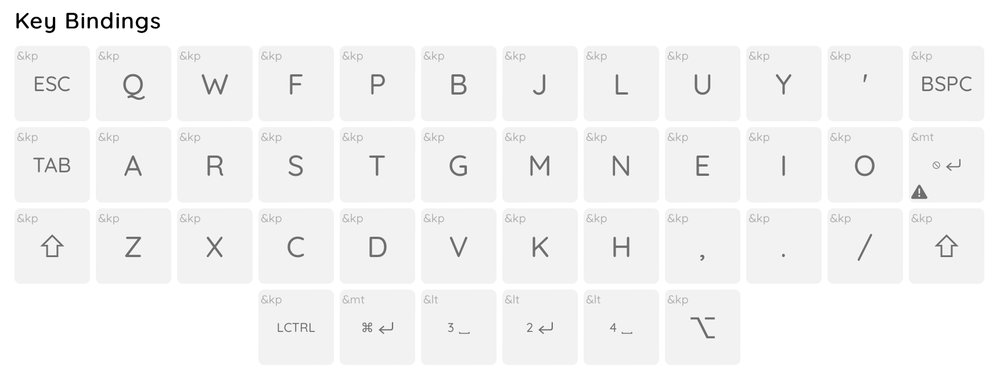
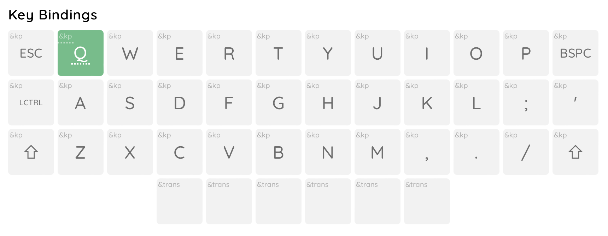
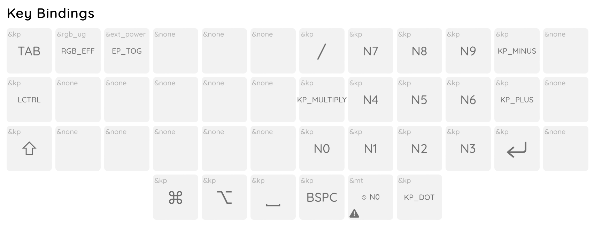
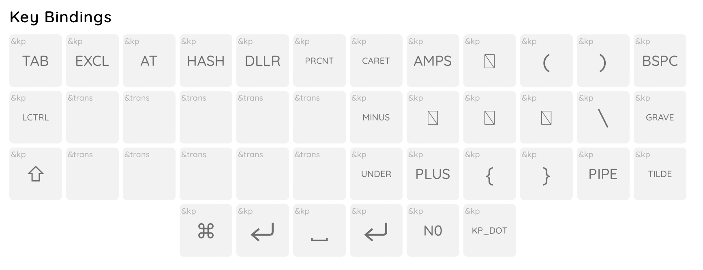
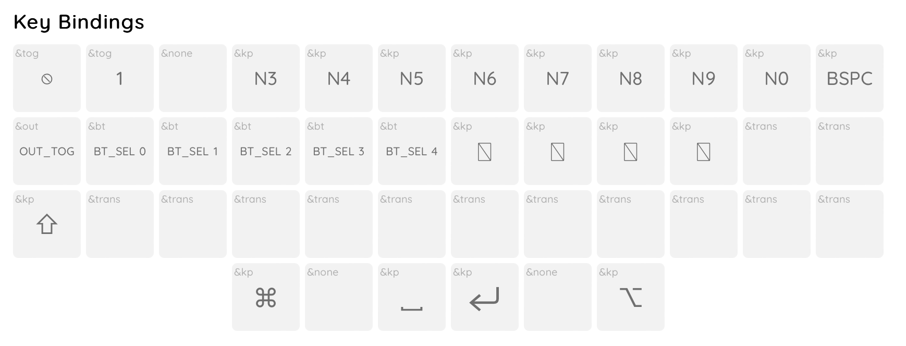

# My current crkbd keymap

[Link to keymap-editor](https://nickcoutsos.github.io/keymap-editor/)
[Link to keyboard-layout-editor](http://www.keyboard-layout-editor.com/#/gists/39d751b9dc2e97a37b8e29fe4aa87cc5)

## Inspiration
The base for this keymap was Max Petretta's [36-key Combo Layout](https://github.com/maxpetretta/keymap)
